# Loomio Pi Stack

[](https://github.com/etiennechabert/loomio-pi-stack/actions/workflows/ci.yml)
[](https://github.com/etiennechabert/loomio-pi-stack/actions/workflows/security.yml)
[](https://opensource.org/licenses/MIT)
[](https://www.docker.com/)
[](https://www.raspberrypi.org/)
[](https://www.loomio.com/)
[](https://github.com/etiennechabert/loomio-pi-stack/graphs/commit-activity)

A comprehensive, production-ready Docker stack for self-hosting [Loomio](https://www.loomio.com/) on Raspberry Pi or any Linux server. Built with security, automation, and ease of use in mind.

## What is Loomio?

Loomio is an open-source collaborative decision-making platform that helps groups make better decisions together. It's perfect for communities, organizations, and teams that want democratic, transparent decision-making.

## Features

### Core Loomio Services
- **Loomio App** - Main application server
- **Loomio Worker** - Background job processing
- **Channels** - Real-time notifications
- **Hocuspocus** - Collaborative editing
- **PostgreSQL 15** - Database backend
- **Redis** - Job queue and caching

### Production Enhancements
- **Automated Backups** - Hourly encrypted backups with optional Google Drive sync
- **System Monitoring** - Netdata for real-time metrics and alerts
- **Health Checks** - Automatic service monitoring and recovery
- **Auto-Updates** - Watchtower for container updates
- **Secure Access** - Cloudflare Tunnel support (no port forwarding needed)
- **Database Admin** - Adminer web interface

### Raspberry Pi Optimized
- ARM-compatible images
- Low resource footprint
- Systemd integration for auto-start
- Stateless boot option for read-only filesystems

## Quick Start

### Prerequisites
- Raspberry Pi 4 (4GB+ RAM recommended) or any Linux server
- Docker and Docker Compose installed
- A domain name (for email and external access)
- SMTP credentials (SendGrid, Mailgun, etc.)

### Installation

**Easy way (using Makefile):**

```bash
# Clone this repository
git clone https://github.com/yourusername/loomio-pi-stack.git
cd loomio-pi-stack

# Run complete first-time setup
make first-time-setup

# Follow the prompts and edit .env when asked
```

**Manual way:**

```bash
# Clone this repository
git clone https://github.com/yourusername/loomio-pi-stack.git
cd loomio-pi-stack

# Copy and configure environment
cp .env.example .env
nano .env  # Edit with your settings

# Generate required secrets
openssl rand -hex 64  # SECRET_KEY_BASE
openssl rand -hex 32  # LOOMIO_HMAC_KEY
openssl rand -hex 32  # DEVISE_SECRET
openssl rand -hex 32  # BACKUP_ENCRYPTION_KEY

# Start the stack
docker compose up -d

# Initialize database
docker compose run app rake db:setup

# Check logs
docker compose logs -f
```

Access Loomio at `http://your-server-ip:3000`

For detailed setup instructions, see [QUICKSTART.md](QUICKSTART.md)

## Architecture

```mermaid
graph TB
    Users[👤 Users] -->|HTTPS| CF[☁️ Cloudflare Tunnel]
    CF --> App

    subgraph "Loomio Pi Stack"
        subgraph "Core Services"
            App[🎯 Loomio App<br/>Port 3000]
            Worker[⚙️ Worker<br/>Background Jobs]
            Channels[📡 Channels<br/>Port 5000]
            Hocus[✏️ Hocuspocus<br/>Port 4000]
        end

        subgraph "Data"
            DB[(🗄️ PostgreSQL)]
            Redis[(💾 Redis)]
        end

        subgraph "Support"
            Backup[💾 Backup<br/>Hourly]
            Netdata[📊 Monitoring<br/>Port 19999]
            Adminer[🔧 DB Admin<br/>Port 8081]
        end
    end

    App --> DB
    App --> Redis
    Worker --> DB
    Worker --> Redis
    Channels --> Redis
    Hocus --> DB

    Backup --> DB
    Backup -.->|Optional| GDrive[☁️ Google Drive]

    Adminer --> DB

    style App fill:#4CAF50,stroke:#2E7D32,stroke-width:3px,color:#fff
    style DB fill:#1976D2,stroke:#0D47A1,stroke-width:2px,color:#fff
    style Redis fill:#DC382D,stroke:#A61C00,stroke-width:2px,color:#fff
```



## Documentation

- **[QUICKSTART.md](QUICKSTART.md)** - Detailed setup guide (30 minutes)
- **[SMTP_SETUP.md](SMTP_SETUP.md)** - Email configuration guide (Gmail, SendGrid, etc.)
- **[ADMIN_USERS.md](ADMIN_USERS.md)** - Admin user creation and management
- **[FEATURES.md](FEATURES.md)** - Languages, translation, SSO, themes, and feature flags
- **[BACKUP_GUIDE.md](BACKUP_GUIDE.md)** - Backup and restore procedures
- **[SECURITY.md](SECURITY.md)** - Security best practices
- **[RESTORE_ON_BOOT.md](RESTORE_ON_BOOT.md)** - Stateless Pi operation
- **[CONTRIBUTING.md](CONTRIBUTING.md)** - How to contribute

## Configuration

### Required Environment Variables

```bash
# Domain and Email
CANONICAL_HOST=loomio.example.com
SUPPORT_EMAIL=support@example.com

# Database
POSTGRES_PASSWORD=your-secure-password

# Secret Keys (generate with openssl)
SECRET_KEY_BASE=...
LOOMIO_HMAC_KEY=...

# SMTP (NO mail server container needed!)
SMTP_SERVER=smtp.gmail.com  # or SendGrid, Mailgun, etc.
SMTP_USERNAME=...
SMTP_PASSWORD=...
```

See [.env.example](.env.example) for all options, or [SMTP_SETUP.md](SMTP_SETUP.md) for email configuration.

**Note:** You don't need to run your own mail server! Use external SMTP services like Gmail, SendGrid, or Mailgun.

### Admin User Creation

**Automatic via Environment Variables (Recommended):**

```bash
# In .env file
LOOMIO_ADMIN_EMAIL=admin@example.com
LOOMIO_ADMIN_PASSWORD=your-secure-password
LOOMIO_ADMIN_NAME=Admin User

# Admin is created automatically on first startup!
```

**Or create manually:**

```bash
# Interactive creation
make create-admin

# Or sign up via web and promote
make make-admin
```

See [ADMIN_USERS.md](ADMIN_USERS.md) for all methods.

## Backup & Restore

### Automated Backups
Backups run hourly (configurable) with AES-256 encryption:

```bash
# View backups
ls -lh backups/

# Manual backup
docker compose exec backup python3 /app/backup.py
```

### Restore Database

```bash
./scripts/restore-db.sh
```

See [BACKUP_GUIDE.md](BACKUP_GUIDE.md) for detailed instructions.

## Monitoring

### Netdata Dashboard
Access at `http://your-server-ip:19999`

Features:
- Real-time system metrics
- Container monitoring
- Custom Loomio health alerts
- Email/Slack notifications

### Health Checks
Automated health monitoring runs every 5 minutes:

```bash
# Manual health check
./scripts/watchdog/health-monitor.sh

# View logs
journalctl -u loomio-watchdog -f
```

## Systemd Integration

Enable auto-start on boot:

```bash
# Copy service files
sudo cp loomio.service /etc/systemd/system/
sudo cp loomio-watchdog.service /etc/systemd/system/
sudo cp loomio-watchdog.timer /etc/systemd/system/

# Enable services
sudo systemctl daemon-reload
sudo systemctl enable loomio.service
sudo systemctl enable loomio-watchdog.timer

# Start
sudo systemctl start loomio.service
sudo systemctl start loomio-watchdog.timer
```

## Administration

### Create Admin User

```bash
# Sign up through web interface first, then:
docker compose run app rails c

# In Rails console:
User.last.update(is_admin: true)
```

### Database Access

**Web Interface:**
- URL: `http://your-server-ip:8081`
- System: PostgreSQL
- Server: db
- Username: loomio
- Password: (from .env)

**Command Line:**
```bash
docker compose exec db psql -U loomio -d loomio_production
```

### View Logs

```bash
# All services
docker compose logs -f

# Specific service
docker compose logs -f app

# Last 100 lines
docker compose logs --tail=100 app
```

## Updating

### Automatic Updates (Watchtower)
Containers update automatically at 3:15 AM daily.

### Manual Update

```bash
docker compose pull
docker compose up -d
```

## Troubleshooting

### Services Won't Start

```bash
# Check status
docker compose ps

# View logs
docker compose logs

# Restart specific service
docker compose restart app
```

### Database Connection Issues

```bash
# Check database health
docker compose exec db pg_isready -U loomio

# Restart database
docker compose restart db
```

### Email Not Sending

1. Verify SMTP settings in `.env`
2. Check Loomio logs: `docker compose logs app | grep -i smtp`
3. Test SMTP connection: `docker compose run app rails c`

```ruby
ActionMailer::Base.smtp_settings
```

### Performance Issues

- Increase `PUMA_WORKERS` and `SIDEKIQ_CONCURRENCY` in `.env`
- Monitor with Netdata
- Check disk space: `df -h`
- Check memory: `free -h`

## Security

- All backups are encrypted with AES-256
- Secrets stored in `.env` (never committed to git)
- Regular security updates via Watchtower
- Optional Cloudflare Tunnel for zero-trust access

See [SECURITY.md](SECURITY.md) for detailed security guidelines.

## Resource Requirements

### Minimum
- **CPU:** 2 cores
- **RAM:** 2GB
- **Disk:** 10GB

### Recommended
- **CPU:** 4 cores
- **RAM:** 4GB
- **Disk:** 20GB SSD

## Contributing

Contributions welcome! Please:

1. Fork the repository
2. Create a feature branch
3. Make your changes
4. Run pre-commit checks: `./scripts/pre-commit-check.sh`
5. Submit a pull request

## License

This stack configuration is MIT licensed. Loomio itself is licensed under AGPL-3.0.

## Support

- **Loomio Documentation:** https://help.loomio.com/
- **Loomio Community:** https://www.loomio.com/community
- **Issues:** https://github.com/yourusername/loomio-pi-stack/issues

## Acknowledgments

- [Loomio Team](https://www.loomio.com/) for the amazing platform
- [loomio-deploy](https://github.com/loomio/loomio-deploy) for deployment reference
- The open-source community

---

**Made with ❤️ for collaborative decision-making**
