# Loomio Pi Stack

[](https://github.com/etiennechabert/loomio-pi-stack/actions/workflows/ci.yml)
[](https://github.com/etiennechabert/loomio-pi-stack/actions/workflows/security.yml)
[](https://github.com/etiennechabert/loomio-pi-stack/network/updates)
[](https://opensource.org/licenses/MIT)
[](https://www.docker.com/)
[](https://www.raspberrypi.org/)

A comprehensive, production-ready Docker stack for self-hosting [Loomio](https://www.loomio.com/) on Raspberry Pi or any Linux server. Built with security, automation, and ease of use in mind.

## What is Loomio?

Loomio is an open-source collaborative decision-making platform that helps groups make better decisions together. It's perfect for communities, organizations, and teams that want democratic, transparent decision-making.

## Features

### Core Loomio Services
- **Loomio App** - Main application server
- **Loomio Worker** - Background job processing
- **Channels** - Real-time notifications
- **Hocuspocus** - Collaborative editing
- **PostgreSQL 15** - Database backend
- **Redis** - Job queue and caching

### Production Enhancements
- **Automated Backups** - Hourly encrypted backups with optional Google Drive sync
- **System Monitoring** - Netdata for real-time metrics and alerts
- **Health Checks** - Automatic service monitoring and recovery
- **Auto-Updates** - Watchtower for container updates
- **Secure Access** - Cloudflare Tunnel support (no port forwarding needed)
- **Database Admin** - Adminer web interface

### Raspberry Pi Optimized
- ARM-compatible images
- Low resource footprint
- Systemd integration for auto-start
- RAM-only operation for read-only filesystems

## Quick Start

```bash
# Clone repository
git clone https://github.com/etiennechabert/loomio-pi-stack.git
cd loomio-pi-stack

# Initialize environment
make init-env
# Edit .env with your settings (domain, SMTP, passwords)

# Start services
make start

# Create admin user
make create-admin
```

Access Loomio at `http://your-server-ip:3000`

**📖 For detailed setup instructions, see [QUICKSTART.md](docs/QUICKSTART.md)**

## Architecture

```mermaid
graph TB
    Users[👤 Users] -->|HTTPS| CF[☁️ Cloudflare Tunnel]
    CF --> App

    subgraph "Loomio Pi Stack"
        subgraph "Core Services"
            App[🎯 Loomio App<br/>Port 3000]
            Worker[⚙️ Worker<br/>Background Jobs]
            Channels[📡 Channels<br/>Port 5000]
            Hocus[✏️ Hocuspocus<br/>Port 4000]
        end

        subgraph "Data"
            DB[(🗄️ PostgreSQL)]
            Redis[(💾 Redis)]
        end

        subgraph "Support"
            Backup[💾 Backup<br/>Hourly]
            Netdata[📊 Monitoring<br/>Port 19999]
            Adminer[🔧 DB Admin<br/>Port 8081]
        end
    end

    App --> DB
    App --> Redis
    Worker --> DB
    Worker --> Redis
    Channels --> Redis
    Hocus --> DB

    Backup --> DB
    Backup -.->|Optional| GDrive[☁️ Google Drive]

    Adminer --> DB

    style App fill:#4CAF50,stroke:#2E7D32,stroke-width:3px,color:#fff
    style DB fill:#1976D2,stroke:#0D47A1,stroke-width:2px,color:#fff
    style Redis fill:#DC382D,stroke:#A61C00,stroke-width:2px,color:#fff
```



## Documentation

### Setup Guides
- **[QUICKSTART.md](docs/QUICKSTART.md)** - Complete installation guide (30 minutes)
- **[SMTP_SETUP.md](docs/SMTP_SETUP.md)** - Email configuration (Gmail, SendGrid, Mailgun, etc.)
- **[BACKUP_GUIDE.md](docs/BACKUP_GUIDE.md)** - Backup, restore, and Google Drive sync

### Configuration
- **[FEATURES.md](docs/FEATURES.md)** - Languages, SSO, themes, and feature flags
- **[SECURITY.md](docs/SECURITY.md)** - Security hardening and best practices
- **[ADMIN_USERS.md](docs/ADMIN_USERS.md)** - User management and administration

### Advanced
- **[docs/INVITE_ONLY_SETUP.md](docs/INVITE_ONLY_SETUP.md)** - Private, invite-only configuration
- **[docs/RAM_MODE.md](docs/RAM_MODE.md)** - RAM-only operation details
- **[docs/RESTORE_ON_BOOT.md](docs/RESTORE_ON_BOOT.md)** - Stateless Pi setup

### Development
- **[CONTRIBUTING.md](docs/CONTRIBUTING.md)** - How to contribute
- **[docs/MIGRATION_SAFETY.md](docs/MIGRATION_SAFETY.md)** - Database migration safety

## Essential Commands

```bash
# Service Management
make start          # Start all services
make stop           # Stop all services
make restart        # Restart services
make status         # Show service status
make logs           # View logs

# User Management
make create-admin   # Create admin user
make rails-console  # Access Rails console

# Backup & Restore
make create-backup  # Manual backup
make restore-backup # Restore from backup
make backup-info    # View backup status

# Monitoring
make health         # Check service health
make sidekiq-status # View job queue status

# Maintenance
make update-images  # Update container images
make help           # Show all commands
```

## Configuration

### Required Settings

Edit `.env` with your settings:

```bash
# Domain & Email
CANONICAL_HOST=loomio.yourdomain.com
SUPPORT_EMAIL=support@yourdomain.com

# Database Password
POSTGRES_PASSWORD=your-secure-password

# Generate secrets with: openssl rand -hex 64
SECRET_KEY_BASE=...
LOOMIO_HMAC_KEY=...
DEVISE_SECRET=...

# SMTP Configuration (external service, not self-hosted)
SMTP_SERVER=smtp.gmail.com
SMTP_PORT=587
SMTP_USERNAME=your-email@gmail.com
SMTP_PASSWORD=your-app-password
```

**💡 You don't need to run your own mail server!** Use external SMTP providers like Gmail, SendGrid, or Mailgun.

See **[.env.example](.env.example)** for all options and **[SMTP_SETUP.md](docs/SMTP_SETUP.md)** for email setup.

## Monitoring & Administration

### Netdata Dashboard
Real-time monitoring at `http://your-server-ip:19999`
- System and container metrics
- Custom Loomio health checks
- Email/Slack alerts

### Adminer (Database Admin)
Web-based database admin at `http://your-server-ip:8081`
- System: PostgreSQL
- Server: `db`
- Database: `loomio_production`
- Username: `loomio`
- Password: (from `.env`)

## Security Features

- ✅ AES-256 encrypted backups
- ✅ Automatic security updates (Watchtower)
- ✅ Zero-trust access via Cloudflare Tunnel
- ✅ Environment-based secrets (never committed)
- ✅ Health monitoring and alerting

See **[SECURITY.md](docs/SECURITY.md)** for security hardening guidelines.

## System Requirements

### Minimum
- **CPU:** 2 cores
- **RAM:** 2GB
- **Disk:** 10GB

### Recommended (Raspberry Pi 4 or better)
- **CPU:** 4 cores
- **RAM:** 4GB
- **Disk:** 20GB+ SSD

## Troubleshooting

### Services won't start
```bash
make status  # Check service status
make logs    # View error logs
make health  # Run health checks
```

### Email not sending
1. Verify SMTP settings in `.env`
2. Check logs: `make logs | grep -i smtp`
3. See **[SMTP_SETUP.md](docs/SMTP_SETUP.md)** for provider-specific guides

### Database issues
```bash
# Check database health
docker compose exec db pg_isready -U loomio

# Access database console
make db-console
```

### Performance issues
- Monitor with Netdata at `:19999`
- Check disk space: `df -h`
- Check memory: `free -h`
- Adjust `PUMA_WORKERS` and `SIDEKIQ_CONCURRENCY` in `.env`

## Contributing

Contributions welcome! Please:

1. Fork the repository
2. Create a feature branch
3. Make your changes
4. Run tests: `make test`
5. Submit a pull request

See **[CONTRIBUTING.md](docs/CONTRIBUTING.md)** for detailed guidelines.

## License

This stack configuration is MIT licensed. Loomio itself is licensed under AGPL-3.0.

## Support

- **Loomio Documentation:** https://help.loomio.com/
- **Loomio Community:** https://www.loomio.com/community
- **Issues:** https://github.com/etiennechabert/loomio-pi-stack/issues

## Acknowledgments

- [Loomio Team](https://www.loomio.com/) for the amazing platform
- [loomio-deploy](https://github.com/loomio/loomio-deploy) for deployment reference
- The open-source community

---

**Made with ❤️ for collaborative decision-making**
